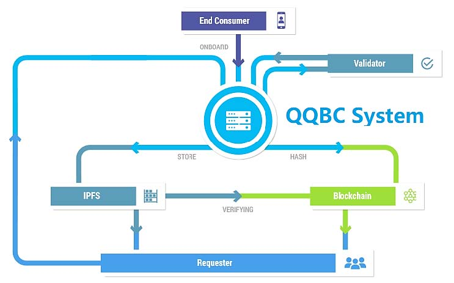

# QQBC文档

随着全球化的发展，国际支付业务也越来越普遍，现有的支付体系的弊端也越来越明显，区块链确实在应对国际支付之中有着明显的优势，但具体的应用同样也有一定的难度。

QQBC利用“区块链+IPFS”技术来打造一个更流畅的国际支付平台。QQBC综合了迄今为止最成功的系统中的众多创意，采用IPFS技术，致力于建立一个全新的去中心化式互联网基础设施，基于此可以构建许多不同类型的应用程序。构建全球化的、可安装的、版本化的支付系统和金融空间。

QQBC主要的技术应用包括区块链技术和IPFS技术，结合智能合约、自证文件系统(SFS)等打造一个低延时、高扩展的系统，给用户更好的体验。

QQBC的生态应用主要是围绕支付业务展开的，具体包括：通过QQBC智能合约(QQSmCt)搭建的QQBC商店(链接器匹配系统)、QQBC通信渠道等。

# QQBC基本

* [项目简介](chap/qqbc-basics.md)
* [目标市场分析](chap/qqbc-marketing.md)
* [通证经济模型](chap/qqbc-tokeneco.md)
* [关键词汇表](chap/qqbc-glossary.md)

# 快速上手

* [安装文档](01-user/00_install/index.md)
* [如何连接测试网](01-user/04_testnet/index.md)
* [命令文档](02-cli/index.md)

## 用户

* [设置本地环境](01-user/00_install/index.md)
  <!--* 获取代码
  * 编译QQBC链
  * 安装可执行文件-->
* 程序和工具
  * [qqbcd](01-user/01_qqbcd/index.md)
  * [qqbccli](01-user/02_qqbccli/index.md)
  * [kqqbcd](01-user/03_kqqbcd/index.md)
<!--  * launcher
  * snapshot
  * eosiocpp-->

## 商户

* 账户和权限
* 数字资产申请
* 数字资产发行

# 功能

* 用户管理
* 资产管理
* 订单管理
* 转账管理

# QQBC服务

* QQSmCt
* QQBC Store
* QQPGP
* QQLP
* 钱包应用
* KYC/AML
* Management Console

# CLI

* [命令介绍](02-cli/qqbccli命令介绍.md)
* [业务命令介绍](02-cli/qqbccli业务命令介绍.md)
* [钱包命令行界面](02-cli/qqbc钱包命令介绍.md)

# QQBC API
# API
* [Account API](03-api/Account-API.md) - 查询账户数据的api.
* [Chain API](03-api/Chain-API.md) - 查询链内部状态的api.
* [Database API](03-api/Database-API.md) - 存储和检索EOS.IO区块链的数据API根据以下广泛结构来组织数据.
* [Math API](03-api/Math-API.md) - 定义常用的数学函数.
* [Action API](03-api/Account-API.md) - 定义用于查询操作属性的API.
<!--* [Memory API]() - 定义常用的记忆功能.-->
* [Console API](03-api/Console-API.md) - 使应用程序能够记录/打印文本消息.
* [System API](03-api/System-API.md) - 定义用于与系统级内部函数进行交互的API.
* [Token API](03-api/Token-API.md) - 定义用于与标准兼容的令牌消息和数据库表进行交互的ABI.
* [Transaction API](03-api/Transaction-API.md) - 定义用于发送事务和内联消息的API.
* [Builtin Types](03-api/Types.md) - 指定typedefs和别名.

# 路线图

* 项目愿景
* 团队成员
* [路线图](http://www.qqbcipfs.com/#roadmap)

# FAQ

* [QQBC whitepaper](http://www.qqbcipfs.com/QQBC_International_Payments_Whitepaper.pdf)
* [Contact QQBC](http://www.qqbcipfs.com/#partners)

# 常用链接

* [QQBC Homepage](http://www.qqbcipfs.com/)
* QQBC Github
* QQBC Community
* Social Media

